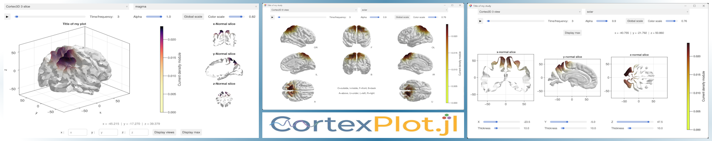
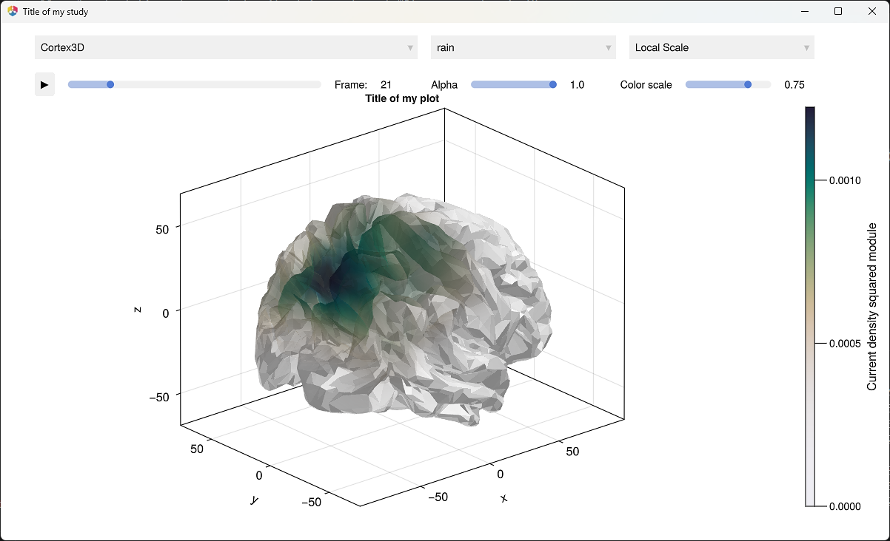
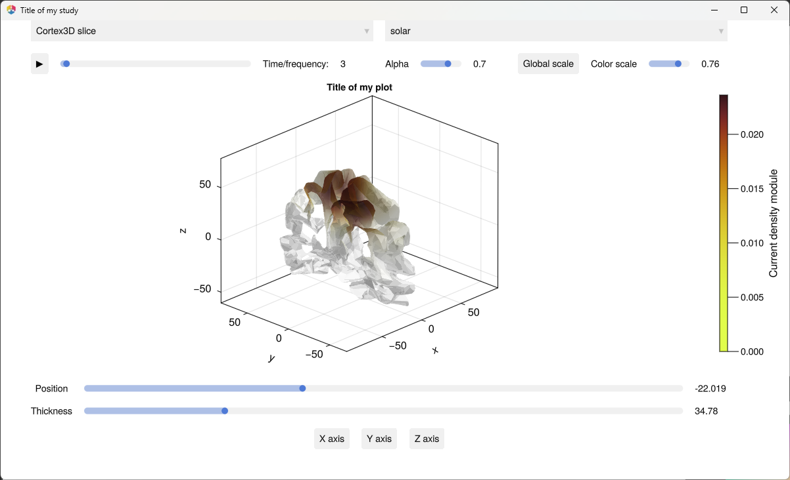
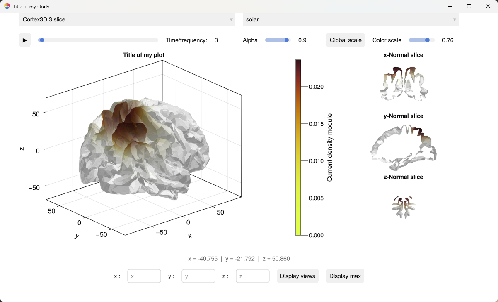
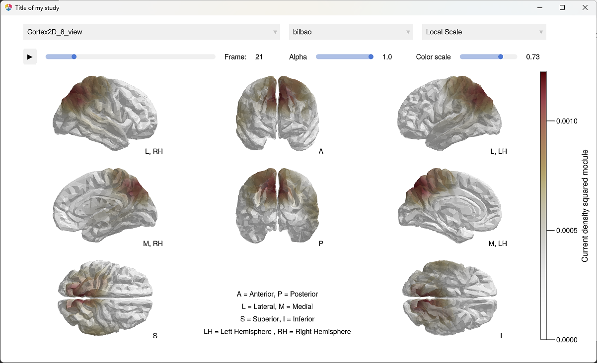
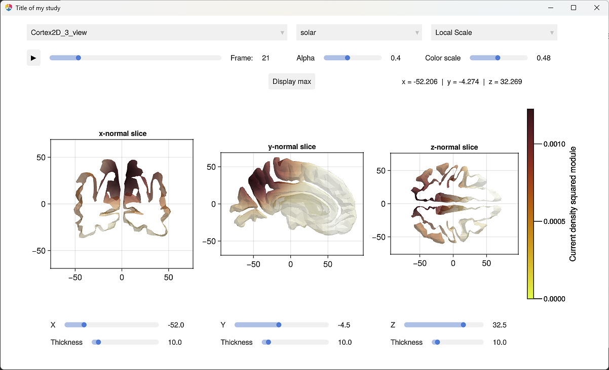

 

---

> [!TIP] 
> 🦅
> This package is part of the [Eegle.jl](https://github.com/Marco-Congedo/Eegle.jl) ecosystem for EEG data analysis and classification.

---

# CortexPlot

This package allows to visualize EEG vector-type distributed inverse solutions data on a standard cortex in 2D and 3D. It is entirely written in [julia](https://julialang.org/) and is powered by [Makie.jl](https://docs.makie.org/stable/). 

The data this package can visualize is easily produced with the help of [Xloreta](https://github.com/Marco-Congedo/Xloreta.jl)

> [!WARNING]
> As usual in Julia, the time to first plot (TTFP) may be long, depending on the PC. From the second plot on, it will be much faster.


## 🧭 Index

- 📦 [Installation](#-installation)
- 🔣 [Description](#-description)
- 🔌 [API](#-api)
- 🎮 [Interactions](#-interactions)
- 💡 [Examples](#-examples)
- ✍️ [About the Author](#️-about-the-author)
- 🌱 [Contribute](#-contribute)


## 📦 Installation

*julia* version 1.10+ is required.

Execute the following command in julia's REPL:

```julia
using Pkg
Pkg.add(url="https://github.com/Marco-Congedo/CortexPlot.jl")
```

[▲ index](#-index)


## 🔣 Description

This package allows the visualization in **2D** and **3D** of **functional brain neuroimaging data** using a color code on top of a structural cortical image. Several kind of plots are available, individually or altogether in a **dashboard** that allows to easily switch from one to the others. All plots can be inspected and several parameters can be changed on the fly within the dashboard. Typical visualizations of this package concern:

- current density square module for *p* voxels as computed by [Xloreta](https://github.com/Marco-Congedo/Xloreta.jl). 

- test-statistics obtained by testing, voxel-by-voxel, *p* hypotheses on data produced by [Xloreta](https://github.com/Marco-Congedo/Xloreta.jl). For instance, one can perform these tests and correct for the multiplicity of comparisons across voxels using [PermutationTests.jl](https://github.com/Marco-Congedo/PermutationTests.jl).


> [!TIP] 
> Several images can be plotted, one after the other or as an animated sequence. The different frames of the sequence typically represent time samples, for example in event-related potentials, frequencies, or experimental conditions. 
>
> The standard cortices used in this package are read from [Leadfields.jl](https://github.com/Marco-Congedo/Leadfields.jl). They have been pre-computed via [BrainStorm](https://neuroimage.usc.edu/brainstorm/Introduction) by [OpenMEEG](https://openmeeg.github.io/), using the ‘fsaverage’ adult head model (FreeSurfer’s default template based on 40 normative brains). The computation of the associated leadfields is based on the Boundary Element Method (BEM).
>
> The available cortex structural data and leadfields correspond to:  
> 1) 7509 unconstrained brain dipolar sources (*p = 2503 voxels* × 3 cartesian orientations); voxel size: 4.3mm (default)
> 2) 15006 unconstrained brain dipolar sources (*p = 5002 voxels* × 3 cartesian orientations); voxel size: 3mm
>
> The cortical data and associated leadfields can be found [here](https://github.com/Marco-Congedo/Leadfields.jl/tree/master/Meshes).

[▲ index](#-index)


## 🔌 API

The package exports only two functions. The main function runs a **dashboard**:

```julia
function cortex_dashboard(data :: Union{Vector{Real}, Matrix{Real}};
                    voxels :: Int = 2503,
                    alpha :: Real = 1.0,
                    title :: String = "Brain activation",
                    colorbar_label :: String = "Current density square module",
                    fontsize :: Real = 16.0,
                    colorscheme :: Symbol = :rain
                    )
```

**Argument**

- `data`: a vector holding the value to be plotted at each voxel, or a matrix where each column is such a vector (a frame for a sequence of images).

**Optional Keyword Arguments**
- `voxels`: the number of voxels *p* forming the solution space. It can be `2503` (default) or `5002`. 
- `alpha`: the transparency of the cortex. By default it is 1.0 (completely opaque). 
- `title`: the title of the plot(s). 
- `colorbar_label`: the label of the color bar. By default it is "current density square module".
- `fontsize`: the size of the font for the axes. Its default value (16.0) is the Makie's default value. 
- `colorscheme`: The initial [color scheme](https://juliagraphics.github.io/ColorSchemes.jl/dev/catalogue/). The default is `:rain`. 


The second exported function, `cortex_plot`, can be used instead of the dashboard when only a specific visualization mode is needed. It supports exactly the same arguments as `cortex_dashboard` with the addition of keyword argument `mode`, which set the visualization mode. Possible values are: 
    `:Cortex3D` (default), `:Cortex3D_slice`, `:Cortex3D_3view`, `:Cortex2D_8view`, and `:Cortex2D_3view` — for the visualization modes see [Interactions](#-interactions).

[▲ index](#-index)


## 🎮 Interactions

The [dashboard](#-api) contains drop-box menus, text boxes, sliders and buttons. Interactions are also possible using the keyboard and the mouse.

### ▼ Drop-Box Menus

The first drop-box menu allows the user to switch between five available display modes:

1) `Cortex3D`: the default display mode, which displays the whole cortex in 3D (Fig. 1). 

<p align="left">
  
  <br>
  <em>Figure 1. Visualization mode "Cortex3D".</em>
</p>


2) `Cortex3D_slice`: displays in 3D a slice of the cortex along the x, y or z axis, with any **position** and **tickness** (Fig. 2).

<p align="left">
  
  <br>
  <em>Figure 2. Visualization mode "Cortex3D_slice".</em>
</p>


3) `Cortex3D_3view`: as 1., but displays also the three sections through a desired voxel. To set the voxel, either point the mouse on the cortex and hit the "V" key, or enter the voxel coordinates in the text boxes (Fig. 3).

<p align="left">
  
  <br>
  <em>Figure 3. Visualization mode "Cortex3D_3view".</em>
</p>


4) `Cortex2D_8view`: displays eight views of the cortex in 2D (Fig. 4).

<p align="left">
  
  <br>
  <em>Figure 4. Visualization mode "Cortex2D_8view".</em>
</p>

5) `Cortex2D_3view`: displays in 2D the three sections of the cortex along the x, y, and z axis, each with any **position** and **tickness** (Fig. 5).

<p align="left">
  
  <br>
  <em>Figure 5. Visualization mode "Cortex2D_3view".</em>
</p>


The second drop-box menu allows to select the color scheme for the color map.

The third drop-box allows to switch between the *Global* and *Local* scaling mode; with *Global* scaling all frames are scaled to the maximum across all frames, while with *Local* scaling each frame is scaled to its own maximum.

### ──●── Sliders

The "Alpha" slider sets the opacity of the cortex. 

The "Color scale" slider sets the non-linearity of the color map.

### 🔲 Buttons

The ▶ button switches between *Play* and *Pause* animation mode. 

The "Display max" button displays the sections through the voxel with maximum value. It applies only to visualization modes 3 and 5.

### ⌨ Keyboard controls

| Key     | Effect | Apply to mode |
|:--------|:-------|:--------------|
| ← / → | display the previous / next frame   |    all      |
| ↑ / ↓ | increase / decrease the position of the slice   |    2.      |
| + / - | increase / decrease the thickness of the slice   |    2.      |
| V | displays the three sections through the voxel under the mouse's pointer   |    3.      |
 
### ⊕ Mouse Controls 

**2D visualization modes**:

- *Primary mouse button click and Drag*: zoom in
- *CTRL + Primary mouse button click*: reset

**3D visualization modes:**

- *Primary mouse button click and Drag*: rotate
- *SHIFT + Primary mouse button click*: reset rotation
- *Secondary mouse button click and Drag*: pan
- *Mouse wheel*: zoom in & out
- *CTRL + Primary mouse button click*: reset pas and zooming

[▲ index](#-index)


## 💡 Examples

Besides **CortexPlot.jl**, The following example makes use of packages 

- [Eegle.jl](https://github.com/Marco-Congedo/Eegle.jl) to import example EEG data
- [Leadfields.jl](https://github.com/Marco-Congedo/Leadfields.jl) to read a leadfield matrix
- [Xloreta.jl](https://github.com/Marco-Congedo/Xloreta.jl) to compute the sLORETA transformation matrix and to compute current density square module vectors from current density vectors.
- [GLMakie.jl](https://docs.makie.org/stable/explanations/backends/glmakie.html), the plotting backend.

To install these packages, run

```julia
add Eegle, Leadfields, Xloreta, CortexPlot, GLMakie
```

Then, run:

```julia
using Eegle, Leadfields, Xloreta, CortexPlot, GLMakie

# read example EEG data, sampling rate and sensor labels using Eegle.jl
X, sr = readASCII(EXAMPLE_Normative_1), 128;
X = X[1:sr, :] # use only the first 128 time samples of X
sensors = readSensors(EXAMPLE_Normative_1_sensors);

# computes a leadfield matrix for 5002 voxels using Leadfields.jl
voxels = 5002 # can also be 2503 for a lower voxel resolution.
K, ename, eloc, gridloc = leadfield(sensors; voxels);

# calculation of sLORETA transformation matrix T with Xloreta.jl.
# NB: in general, the alpha (regularization) value for the inverse solution should be 
# carefully chosen depending on the data. Here it is set to 1 (second argument).
T = sLORETA(Float64.(K), 1);

# calculation of curent density for each time sample in EEG data X. 
# J_raw is a matrix of size (voxels*3) × n_samples in X
J_raw = T * Transpose(X)  

# calculation of current density module (size : voxels × n_times) using Xloreta.jl
# This is the data that will be visualized, frame by frame (column by column)
J = hcat((cd2sm(Vector(c)) for c in eachcol(J_raw))...)  

# This is optional, to have a title and display in full screen mode directly
GLMakie.activate!(title = "Title of my study", fullscreen = true) 

# Run the dashboard to visualize the data
cortex_dashboard(J; title="Title of my plot", voxels) 

# if a specific mode is desired, use instead, for example
#cortex_plot(J; voxels, mode = :cortex3D_slice)
```

[▲ index](#-index)


## ✍️ About the Author

[Marco Congedo](https://github.com/Marco-Congedo), [Arthur Tatlian](https://github.com/Arthtat) and [Esteban Padilla](https://github.com/Padilla-Esteban)

[▲ index](#-index)


## 🌱 Contribute

Please contact the first author if you are interested in contributing.

[▲ index](#-index)